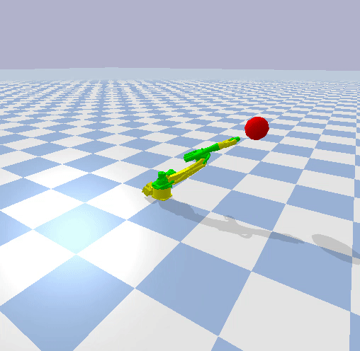

# multi_kuka_sim
This package contains a simulation pipeline interfacing pybullet, gym and baselines. The package can be used to spawn multiple KUKA KR5 ARCs and train them to solve a multi-robot manipulation task. A KUKA version of the reacher task is shown in the figure below.

